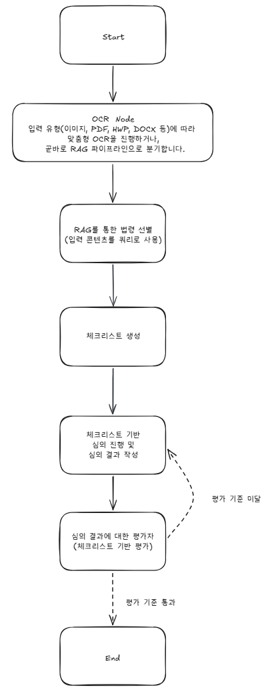

# LangGraph 구조

## 노드 목록

| 노드 | 역할 |
|------|------|
| `ocr_node` | 파일 → 텍스트 추출 (PyMuPDF / Gemini Vision / docx / libhwp) |
| `rag_node` | input_text + ocr_text를 쿼리로 PostgreSQL+pgvector에서 법령 검색 |
| `checklist_node` | gemini-2.5-flash로 체크리스트 생성 |
| `review_node` | gemini-2.5-flash로 심의 결과 작성 (텍스트 + 이미지 통합 처리) |
| `evaluator_node` | 체크리스트 대비 심의 결과 평가, 점수/피드백 반환 |

## 엣지 & 라우팅

```
START -> ocr_node -> rag_node -> checklist_node -> review_node

review_node -> evaluator_node
  -> (score >= 80 or loop_count >= 3) -> END
  -> (score < 80 and loop_count < 3)  -> review_node (루프)
```

> **참고**: `checklist_node`는 루프 밖에 위치하여 최초 1회만 실행된다. 재심의 시 체크리스트는 고정되며, `evaluator_node`가 동일한 기준으로 재평가한다.

## Checkpointer 설정

단기 메모리 및 장기 메모리 접근을 위해 `AsyncPostgresSaver`를 사용한다. 자세한 내용은 [memory.md](./memory.md) 참조.

checkpointer와 graph 컴파일은 FastAPI `lifespan`에서 한 번만 수행한다. 상세 패턴은 [memory.md — 구현 섹션](./memory.md) 참조.

## 워크플로우 다이어그램


