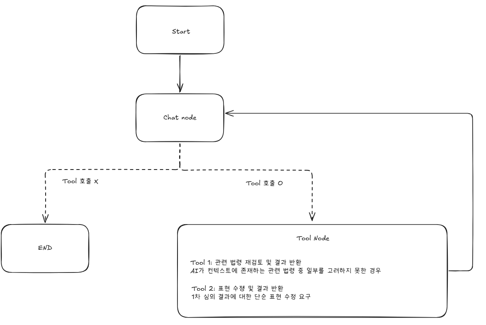

# LangGraph 구조

## 노드 목록

| 노드 | 역할 |
|------|------|
| `chatbot_node` | `model_with_tools`로 messages 전체 + 시스템 메시지를 보내 응답 생성. tool call이 있으면 AIMessage에 `tool_calls`가 담김 |
| `tool_node` | LangGraph 내장 `ToolNode`. `tool_calls`를 실행하고 ToolMessage를 messages에 추가 |

## 엣지 & 라우팅

```
START → chatbot_node
           ├─(tool call 없음)─→ END
           └─(tool call 있음)─→ tool_node → chatbot_node
```

### 조건 엣지 — `should_continue`

```python
from langgraph.graph import END

def should_continue(state: ChatState) -> str:
    if state["messages"][-1].tool_calls:
        return "tools"
    return END
```

- `chatbot_node` 실행 후 마지막 메시지에 `tool_calls`가 있으면 `tool_node`로 분기
- `tool_calls`가 없으면 AIMessage가 최종 응답 → END

## Tool 목록

`tool_node`가 실행할 수 있는 도구 목록. 상세 명세는 각 파일 참조.

| 도구 | 파일 | 설명 |
|------|------|------|
| `law_review` | [nodes/law_review.md](./nodes/law_review.md) | 기존 `law_list` 전체를 반영해 심의 결과 재작성 |
| `expression_edit` | [nodes/expression_edit.md](./nodes/expression_edit.md) | 특정 표현만 수정 |

## Checkpointer 설정

Phase 1과 동일한 `AsyncPostgresSaver` 인스턴스를 공유한다.

```python
# main.py lifespan — 챗봇 그래프 추가 컴파일
app.state.chatbot_graph = chatbot_workflow.compile(checkpointer=checkpointer)
```

- **thread_id 형식**: `chat_threads.thread_id` (UUID) — Phase 1의 `str(content_version_id)` 형식과 달라 충돌 없음
- **config 전달**:

```python
config = {"configurable": {"thread_id": str(chat_thread_id)}}
result = await chatbot_graph.ainvoke(initial_state, config=config)
```

자세한 내용은 [memory.md](./memory.md) 참조.

## 워크플로우 다이어그램


